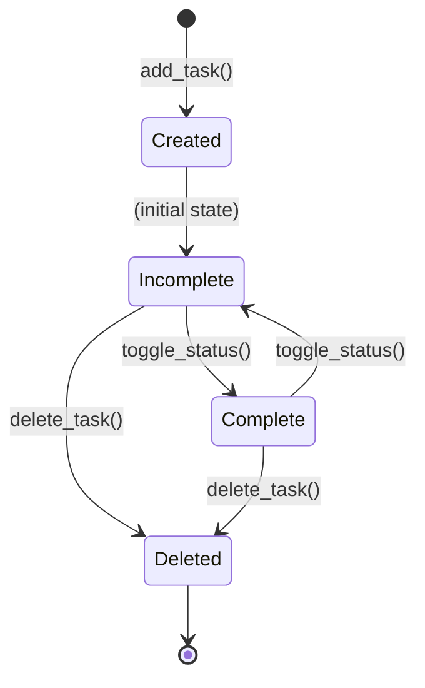

# Data Model: Basic Todo Operations

**Feature**: 1-Basic-Todo-Operations
**Date**: 2025-12-29
**Purpose**: Define data entities, relationships, and validation rules

## Entities

### Task

**Description**: Represents a single todo item in the in-memory task list

**Attributes**:

| Name | Type | Description | Constraints | Validation |
|------|-------|-------------|-------------|------------|
| task_id | int | Unique sequential identifier (1, 2, 3, ...) | Must be > 0, <= len(tasks) |
| title | str | Task name | Non-empty, non-whitespace |
| description | str | Additional details | Optional, can be empty string |
| status | str | Current task state | Must be "incomplete" or "complete" |

**Default Values**:
- `status`: "incomplete" (initial state when task is created)

**State Transitions**:



**Lifecycle**:
1. **Created**: When user executes `add` command
2. **Modified**: When user executes `update` or `complete` commands
3. **Deleted**: When user executes `delete` command
4. **Exists only in memory**: Data is lost when Python process terminates

## Data Structure

### In-Memory Task List

```python
from dataclasses import dataclass
from typing import List

@dataclass
class Task:
    """Represents a single todo item in the in-memory list."""
    task_id: int
    title: str
    description: str
    status: str  # "incomplete" or "complete"

# Global task storage
_tasks: List[Task] = []
```

### Index Management

**Initial Assignment**:
- New task receives `task_id = len(_tasks) + 1`

**After Deletion**:
- All tasks are reindexed to maintain 1-to-N sequential IDs
- Implementation: `_reassign_ids()` function iterates and reassigns

**Example**:

```
Before deletion: [Task(1), Task(2), Task(3), Task(4), Task(5)]
Delete task 3
After deletion:  [Task(1), Task(2), Task(4), Task(5)]
After reindex: [Task(1), Task(2), Task(3), Task(4)]
```

## Validation Rules

### Title Validation

```python
def validate_title(title: str) -> None:
    """
    Validate that task title is non-empty and not whitespace-only.

    Args:
        title: Task title to validate

    Raises:
        ValueError: If title is empty or whitespace-only

    Error Message: "Error: Task title cannot be empty"
    """
    if not title or not title.strip():
        raise ValueError("Task title cannot be empty")
```

### Task ID Validation

```python
def validate_task_id(task_id: int, tasks: List[Task]) -> None:
    """
    Validate that task ID exists in the task list.

    Args:
        task_id: Task ID to validate
        tasks: List of existing tasks

    Raises:
        IndexError: If task_id is out of valid range

    Error Message: "Error: Task with ID {task_id} not found"
    """
    if task_id < 1 or task_id > len(tasks):
        raise IndexError(f"Task with ID {task_id} not found")
```

### Description Validation

- No validation required (optional field, can be empty string)

### Status Validation

```python
def validate_status(status: str) -> None:
    """
    Validate that status is a valid value.

    Args:
        status: Status value to validate

    Raises:
        ValueError: If status is not "incomplete" or "complete"

    Error Message: "Error: Invalid status '{status}'. Must be 'incomplete' or 'complete'"
    """
    if status not in ("incomplete", "complete"):
        raise ValueError(f"Invalid status '{status}'. Must be 'incomplete' or 'complete'")
```

## Helper Functions

### Index Helpers

```python
def _next_id(tasks: List[Task]) -> int:
    """
    Calculate the next available task ID.

    Args:
        tasks: Current list of tasks

    Returns:
        Next sequential task ID (len(tasks) + 1)
    """
    return len(tasks) + 1


def _reassign_ids(tasks: List[Task]) -> None:
    """
    Reassign sequential IDs to all tasks after deletion.

    Args:
        tasks: List of tasks to reindex (modified in-place)

    Returns:
        None (tasks modified in-place)
    """
    for idx, task in enumerate(tasks, start=1):
        task.task_id = idx
```

### Task Lookup

```python
def get_task(task_id: int, tasks: List[Task]) -> Task:
    """
    Retrieve a task by its ID.

    Args:
        task_id: Task ID to retrieve
        tasks: List of tasks to search

    Returns:
        Task object with the specified ID

    Raises:
        IndexError: If task_id is not found
    """
    validate_task_id(task_id, tasks)
    return tasks[task_id - 1]  # Convert 1-indexed to 0-indexed
```

## Relationships

**No relationships** - Tasks are independent entities with no dependencies or associations.

## Invariants

1. **ID Uniqueness**: All task IDs in the list are unique (1, 2, 3, ... N)
2. **Sequential IDs**: Task IDs always form a continuous sequence from 1 to N
3. **Status Validity**: All tasks have status "incomplete" or "complete"
4. **Title Non-Empty**: All tasks have non-empty, non-whitespace titles

## Examples

### Adding Tasks

```python
# Initial state: _tasks = []

# Add first task
task1 = Task(task_id=1, title="Buy groceries", description="Milk, eggs", status="incomplete")
_tasks.append(task1)
# Result: _tasks = [Task(1, "Buy groceries", "Milk, eggs", "incomplete")]

# Add second task
task2 = Task(task_id=2, title="Walk dog", description="", status="incomplete")
_tasks.append(task2)
# Result: _tasks = [Task(1), Task(2)]
```

### Deleting Tasks

```python
# Initial state: _tasks = [Task(1), Task(2), Task(3), Task(4)]

# Delete task 2
del _tasks[1]  # Remove Task(2)
# Result: _tasks = [Task(1), Task(3), Task(4)]

# Reassign IDs
_reassign_ids(_tasks)
# Result: _tasks = [Task(1), Task(2), Task(3)]
```

## Compliance

✅ All data model decisions comply with constitution:
- I. In-Memory Only: Using Python lists only
- II. Phase 1 Scope: Single Task entity with 5 operations
- III. Zero External Dependencies: dataclasses, typing only
- IV. Console/CLI Interface: No CLI concerns (separation of concerns)
- V. Modular and Testable: Clear functions, type hints, validation
- VI. Demo-Ready Quality: Simple, well-documented model

## Notes

- All task data exists only for duration of Python process execution
- Duplicate task titles are allowed (tasks identified by ID, not title)
- Task description is optional and can be empty string
- All validation raises specific exceptions with clear error messages
- ID reassignment after deletion ensures consistent 1-to-N indexing
